# Information protection — HR

In this section we create a Sensitive Information Type (SIT) for employment contracts and use it in a Highly Confidential/HR label that limits access to HR group members only. We add automation so the label is recommended to users when the EmploymentContract SIT is detected, then publish the label to the HR group so it appears in Office apps and can be applied to relevant content.

### Create a custom SIT — HR

Reference: [Create a custom SIT from scratch](https://learn.microsoft.com/en-us/purview/sit-create-a-custom-sensitive-information-type#create-a-custom-sit-from-scratch)

1. In Microsoft Purview, go to **Information protection** > **Classifiers** > **Sensitive info types**.
2. Select **+ Create sensitive info type**.
3. On **Name and description**, set both **Name** and **Description** to `EmploymentContract`, then select **Next**.
4. On **Define patterns**, select **+ Create pattern** and configure the two patterns below.

#### Pattern 1

- Confidence level: **Medium**
- Choose and define the **Primary element**: a Keyword list
  - ID: `employmentcontract`
  - Keywords (case insensitive): `employment contract`
  - Match type: Word match
- Character proximity: leave default value of `300`
- Add **Supporting elements** — Groups: **All of these** > Add more > Keyword list. Use the keyword lists from Table 1 below.

| Keyword list ID | Keywords | Match type |
|---|---|---|
| `companyname` | `contoso`, `contoso ltd` | Word match |
| `employer` | `employer` | Word match |
| `jobtitle` | `job title` | Word match |
| `businessid` | `FI12833678` | String match |

_Table 1. Supporting elements for Pattern 1, HR._

Once all keyword lists from Table 1 are added, the result should look like the image below.

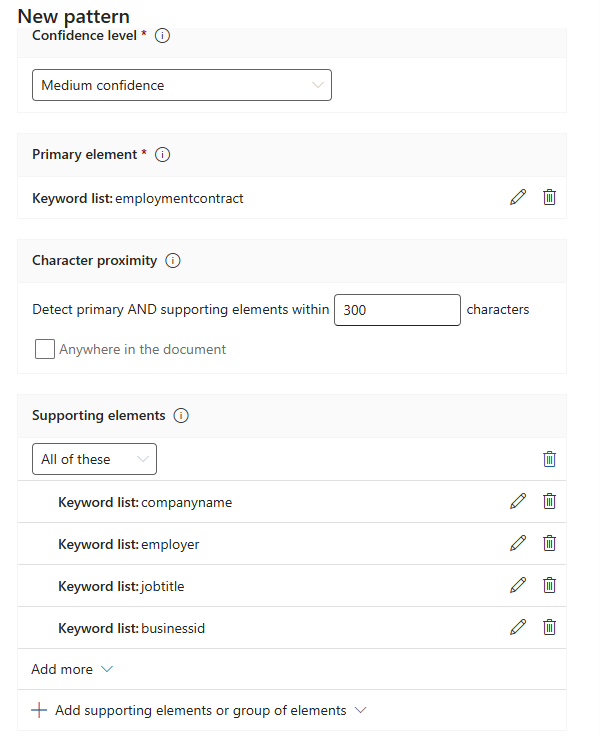

#### Pattern 2

- Select **+ Create pattern**, then choose and define the **Primary element**: a Keyword list
  - ID: `employee`
  - Keywords (case insensitive): `employee`
  - Match type: Word match
- Confidence level: **High**
- Character proximity: leave default value of `300`
- Supporting elements — Groups: **Any of these** > Add more > **Functions**:
  - `Func_finnish_national_id`
  - `Func_swedish_national_identifier`
  - `Func_denmark_eu_tax_file_number`
  - `Func_norway_id_number`
  - `Func_spanish_social_security_number`
  - `Func_italy_eu_national_id_card`

Once all functions are added, the result should look like the image below.

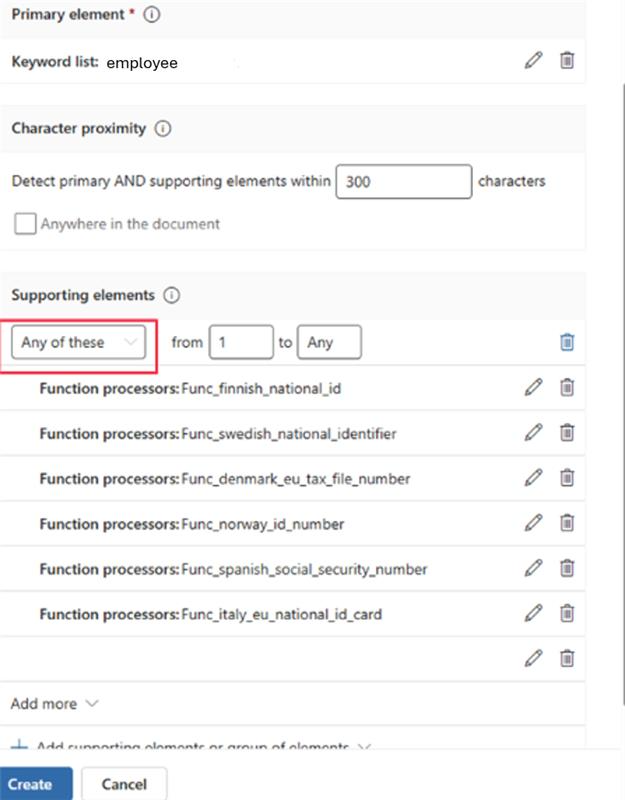

#### Review and create

1. Review the configured patterns, then select **Next**.
2. Keep the default confidence level (this leads to the fewest false positives) and select **Next**.
3. On **Review settings**, verify all details, then select **Create**.

> **Verify:** in **Information protection** > **Sensitive info types**, `EmploymentContract` appears with status **Published**.

### Create a sensitivity label — Highly Confidential/HR

Reference: [Create and configure sensitivity labels](https://learn.microsoft.com/en-us/purview/create-sensitivity-labels?tabs=modern-label-scheme#create-and-configure-sensitivity-labels)

1. Go to **Information protection** > **Sensitivity labels**, select **Highly Confidential**, then **+ Create label in group**.

   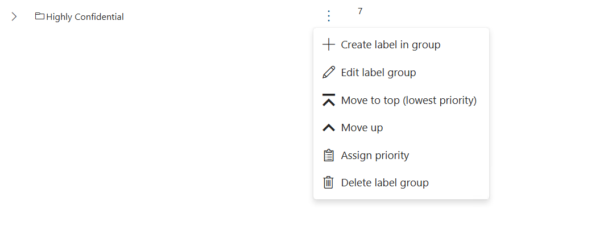

2. **Label details:**
   - **Name:** `HR`
   - **Display name:** `HR`
   - **Label priority:** leave the default selection, **Highest in label group**
   - **Description for users:** This label is used for documents that contain HR-sensitive or confidential employee information.
   - **Description for admins:** This sensitivity label is intended for content that contains confidential Human Resources (HR) information and requires restricted access and enhanced protection controls.

3. **Scope** — select all of:
   - Files & other data assets
   - Emails
   - Groups & sites

4. **Items** — select:
   - Control access
   - Apply content marking

5. **Items > Access control:**
   - Select **Configure access control settings**
   - Assign permissions now or let users decide?: **Assign permissions now**
   - User access to content expires: **Never**
   - Allow offline access: **Never**
   - Assign permissions to specific users and groups: **Assign permissions** > **Add users or groups** > select the **HR** group

6. **Items > Content marking:**
   - Turn on the toggle
   - Select **Add a footer**
   - Customize text — footer text: `Classified as Highly Confidential`

7. **Items > Auto-labeling for files and emails:**
   - Turn the toggle on
   - Add condition > **content contains** > SIT `EmploymentContract`
   - Add **Trainable classifier**: `Employment Agreement`

   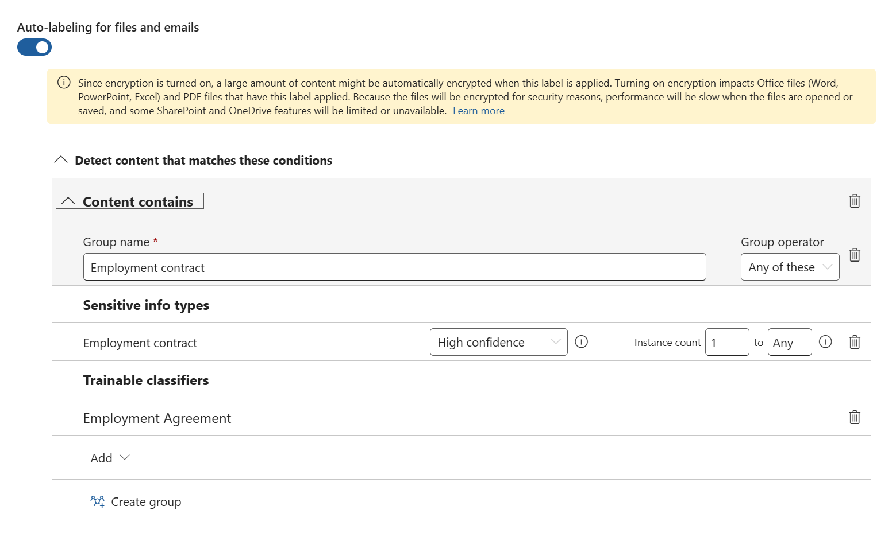

   - When content matches these conditions: **Recommend that user apply the label**
   - Display this message to users when the label is applied: _This document contains confidential Human Resources (HR) information and requires restricted access and enhanced protection controls._

   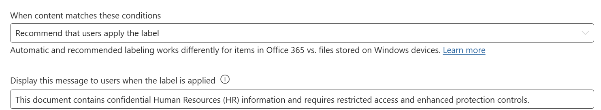

8. **Groups & sites** — check all options and continue.
9. **Groups & sites > Privacy & external user access** — leave default settings.
10. **Groups & sites > External sharing & conditional access:**

    > _Microsoft Entra Conditional Access is out of scope for this exercise — leave it unchecked._

    - Control external sharing from labeled SharePoint sites: **only people in your organization**

    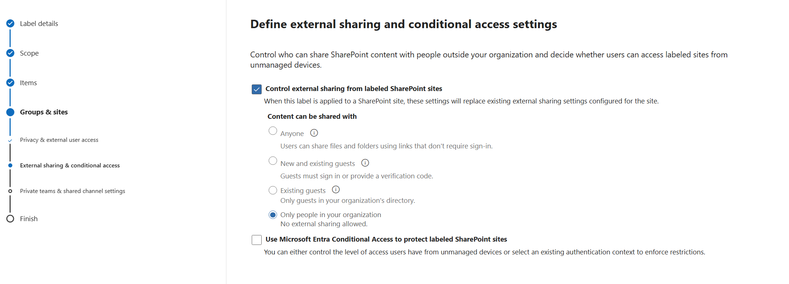

11. **Groups & sites > Private teams & shared channel settings:**
    - Private team discoverability: **Unchecked**
    - Teams shared channels: **Internal only**

    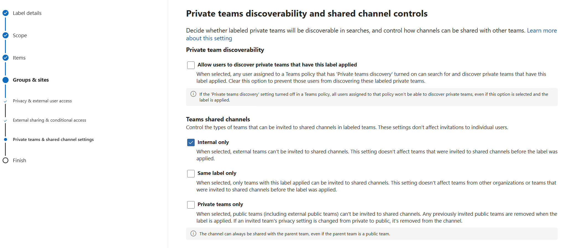

12. Review your settings and select **Create label**.

> **Verify:** in **Sensitivity labels**, the `HR` label appears nested under **Highly Confidential**.

### Create the HR sensitivity label publishing policy

Reference: [Publish sensitivity labels by creating a label policy](https://learn.microsoft.com/en-us/purview/create-sensitivity-labels?tabs=modern-label-scheme#publish-sensitivity-labels-by-creating-a-label-policy)

1. Go to **Information protection** > **Policies** > **Label publishing policies**.
2. Select **Publish label**.

   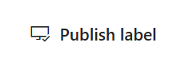

3. **Label to publish:** Highly Confidential/HR
4. **Admin units:** select **Next**.
5. **Users and groups:** select **Edit**, choose **Include only specific**, and add the **HR** Microsoft 365 group created in Phase 1.

   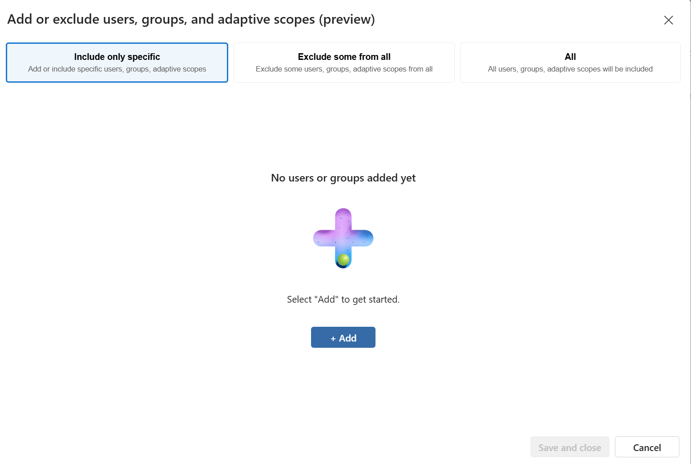

6. **Settings** — select both:
   - Users must provide a justification to remove a label or lower its classification
   - Require users to apply a label to their emails and documents

   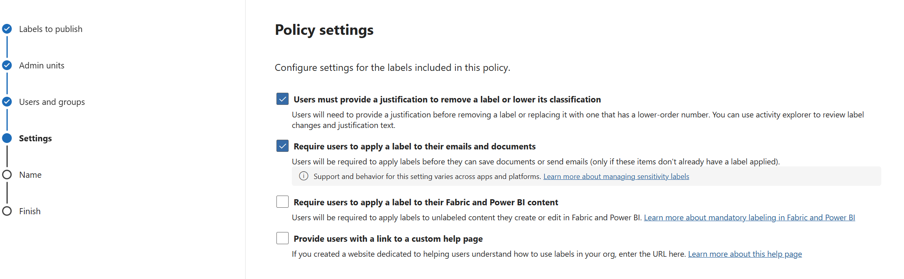

7. Select **Next**.
8. Leave the default settings for the next few steps (Documents, Emails, Sites & Groups, etc.).
9. Name the policy `HR publishing policy`.
10. **Review and finish** > **Submit**.

> **Verify:** the **HR publishing policy** appears with status **On (success)** within a few minutes. After up to 24 hours, the **HR** label is selectable in Word, Excel, PowerPoint, and Outlook for HR group members

### Appendix 1. HR SIT

The keywords used in the HR sensitive information type are taken from the sample employment contract document. The screenshots below show the source document and which fields each keyword targets.

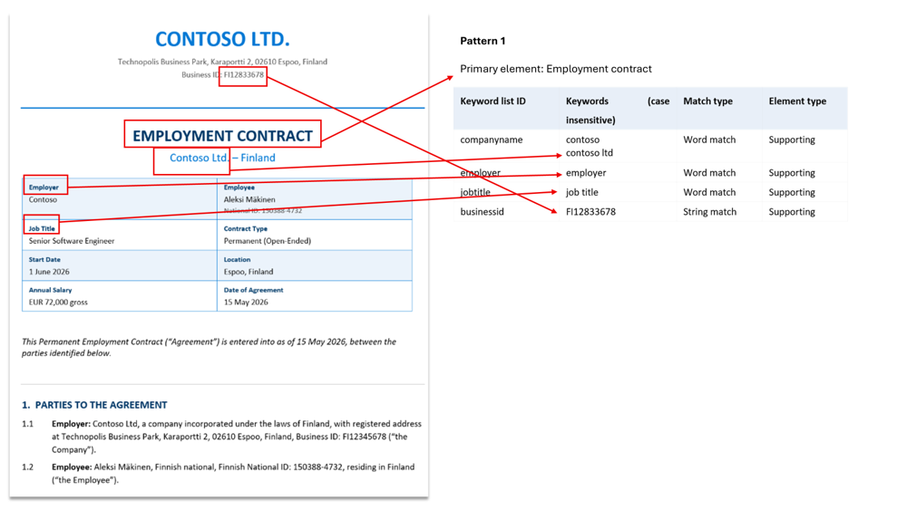

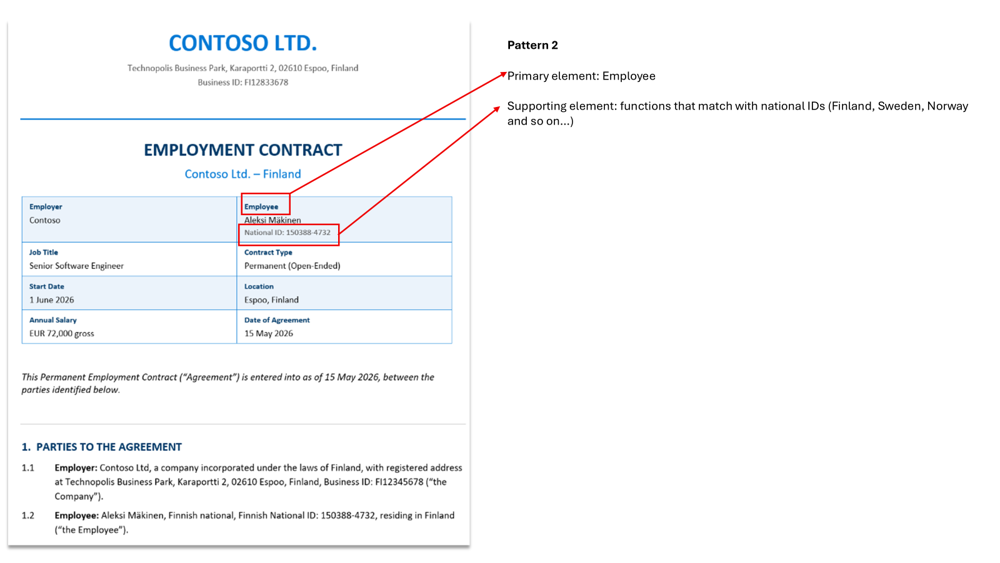
