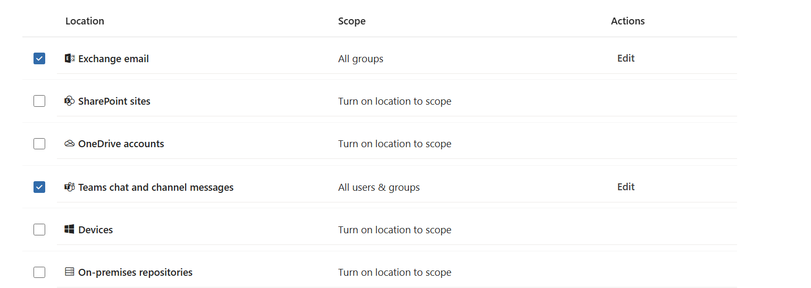
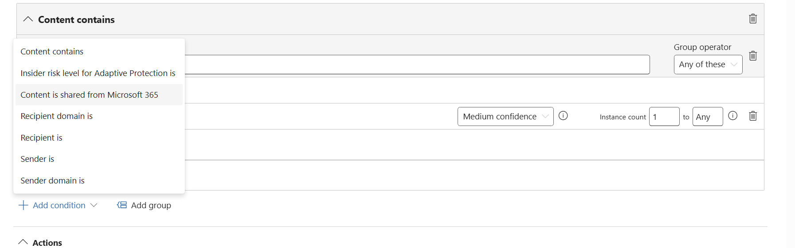
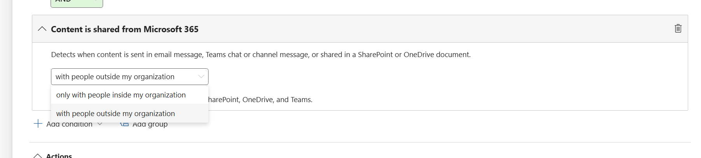
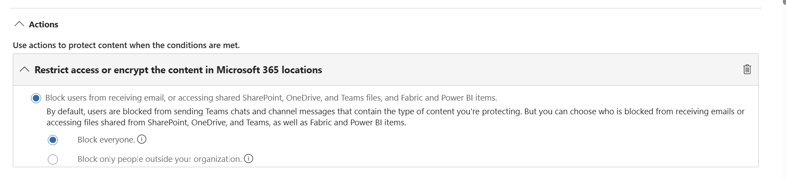
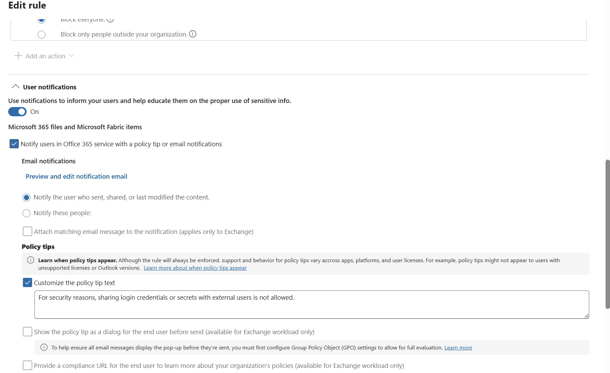

# LAB Guide - Part 1

## Prerequisites

Before starting this phase, complete [Phase 1 — Before the Lab](01-before-the-lab.md):

- Microsoft 365 E5 Developer Subscription tenant (instant sandbox) is provisioned.
- A dedicated Edge profile is signed in as the **admin user**.
- The **HR** Microsoft 365 group exists.
- Audit logging is enabled in Microsoft Purview.
- Sensitivity labels for containers are enabled (via [`scripts/`](../scripts/) or manually).

# Information protection — HR

In this section we create a Sensitive Information Type (SIT) for employment contracts and use it in a Highly Confidential/HR label that limits access to HR group members only. We add automation so the label is recommended to users when the EmploymentContract SIT is detected, then publish the label to the HR group so it appears in Office apps and can be applied to relevant content.

## Create a custom SIT — HR

Reference: [Create a custom SIT from scratch](https://learn.microsoft.com/en-us/purview/sit-create-a-custom-sensitive-information-type#create-a-custom-sit-from-scratch)

1. In Microsoft Purview, go to **Information protection** > **Classifiers** > **Sensitive info types**.
2. Select **+ Create sensitive info type**.
3. On **Name and description**, set both **Name** and **Description** to `EmploymentContract`, then select **Next**.
4. On **Define patterns**, select **+ Create pattern** and configure the two patterns below.

#### Pattern 1

- Confidence level: **Medium**
- Choose and define the **Primary element**: a Keyword list
  - ID: `employmentcontract`
  - Keywords (case insensitive): `employment contract`
  - Match type: Word match
- Character proximity: leave default value of `300`
- Add **Supporting elements** — Groups: **All of these** > Add more > Keyword list. Use the keyword lists from Table 1 below.

| Keyword list ID | Keywords | Match type |
|---|---|---|
| `companyname` | `contoso`, `contoso ltd` | Word match |
| `employer` | `employer` | Word match |
| `jobtitle` | `job title` | Word match |
| `businessid` | `FI12833678` | String match |

_Table 1. Supporting elements for Pattern 1, HR._

Once all keyword lists from Table 1 are added, the result should look like the image below.

#### Pattern 2

- Select **+ Create pattern**, then choose and define the **Primary element**: a Keyword list
  - ID: `employee`
  - Keywords (case insensitive): `employee`
  - Match type: Word match
- Confidence level: **High**
- Character proximity: leave default value of `300`
- Supporting elements — Groups: **Any of these** > Add more > **Functions**:
  - `Func_finnish_national_id`
  - `Func_swedish_national_identifier`
  - `Func_denmark_eu_tax_file_number`
  - `Func_norway_id_number`
  - `Func_spanish_social_security_number`
  - `Func_italy_eu_national_id_card`

Once all functions are added, the result should look like the image below.

### Review and create

1. Review the configured patterns, then select **Next**.
2. Keep the default confidence level (this leads to the fewest false positives) and select **Next**.
3. On **Review settings**, verify all details, then select **Create**.

> **Verify:** in **Information protection** > **Sensitive info types**, `EmploymentContract` appears with status **Published**.

## Create a sensitivity label — Highly Confidential/HR

Reference: [Create and configure sensitivity labels](https://learn.microsoft.com/en-us/purview/create-sensitivity-labels?tabs=modern-label-scheme#create-and-configure-sensitivity-labels)

1. Go to **Information protection** > **Sensitivity labels**, select **Highly Confidential**, then **+ Create label in group**.

   

2. **Label details:**
   - **Name:** `HR`
   - **Display name:** `HR`
   - **Label priority:** leave the default selection, **Highest in label group**
   - **Description for users:** This label is used for documents that contain HR-sensitive or confidential employee information.
   - **Description for admins:** This sensitivity label is intended for content that contains confidential Human Resources (HR) information and requires restricted access and enhanced protection controls.

3. **Scope** — select all of:
   - Files & other data assets
   - Emails
   - Groups & sites

4. **Items** — select:
   - Control access
   - Apply content marking

5. **Items > Access control:**
   - Select **Configure access control settings**
   - Assign permissions now or let users decide?: **Assign permissions now**
   - User access to content expires: **Never**
   - Allow offline access: **Never**
   - Assign permissions to specific users and groups: **Assign permissions** > **Add users or groups** > select the **HR** group

6. **Items > Content marking:**
   - Turn on the toggle
   - Select **Add a footer**
   - Customize text — footer text: `Classified as Highly Confidential`

7. **Items > Auto-labeling for files and emails:**
   - Turn the toggle on
   - Add condition > **content contains** > SIT `EmploymentContract`
   - Add **Trainable classifier**: `Employment Agreement`

   

   - When content matches these conditions: **Recommend that user apply the label**
   - Display this message to users when the label is applied: _This document contains confidential Human Resources (HR) information and requires restricted access and enhanced protection controls._

   

8. **Groups & sites** — check all options and continue.
9. **Groups & sites > Privacy & external user access** — leave default settings.
10. **Groups & sites > External sharing & conditional access:**

    > _Microsoft Entra Conditional Access is out of scope for this exercise — leave it unchecked._

    - Control external sharing from labeled SharePoint sites: **only people in your organization**

    

11. **Groups & sites > Private teams & shared channel settings:**
    - Private team discoverability: **Unchecked**
    - Teams shared channels: **Internal only**

    

12. Review your settings and select **Create label**.

> **Verify:** in **Sensitivity labels**, the `HR` label appears nested under **Highly Confidential**.

## Create the HR sensitivity label publishing policy

Reference: [Publish sensitivity labels by creating a label policy](https://learn.microsoft.com/en-us/purview/create-sensitivity-labels?tabs=modern-label-scheme#publish-sensitivity-labels-by-creating-a-label-policy)

1. Go to **Information protection** > **Policies** > **Label publishing policies**.
2. Select **Publish label**.

   

3. **Label to publish:** Highly Confidential/HR
4. **Admin units:** select **Next**.
5. **Users and groups:** select **Edit**, choose **Include only specific**, and add the **HR** Microsoft 365 group created in Phase 1.

   

6. **Settings** — select both:
   - Users must provide a justification to remove a label or lower its classification
   - Require users to apply a label to their emails and documents

   

7. Select **Next**.
8. Leave the default settings for the next few steps (Documents, Emails, Sites & Groups, etc.).
9. Name the policy `HR publishing policy`.
10. **Review and finish** > **Submit**.

> **Verify:** the **HR publishing policy** appears with status **On (success)** within a few minutes. After up to 24 hours, the **HR** label is selectable in Word, Excel, PowerPoint, and Outlook for HR group members.

# Information protection — Project DogOps

In this section, you protect ProjectDogOps content by:

1. Defining a custom SIT based on keyword dictionaries.
2. Creating a DogOps sensitivity label with **client-side** auto-labeling.
3. Configuring a **service-side** auto-labeling policy that detects and protects matching content across Microsoft 365 locations.

Together these steps demonstrate how custom classifiers, sensitivity labels, and automated policies identify, label, and safeguard confidential project information. Access to Project DogOps material is limited to the **U.S. Sales** group, which already exists in your CDX tenant.

## Create a custom SIT — ProjectDogOps

1. The keyword dictionaries are included in this repo:
   - [`data/DogBreeds.txt`](../data/DogBreeds.txt)
   - [`data/DogWords.txt`](../data/DogWords.txt)

   Save them locally so you can upload them in the wizard.

2. In Microsoft Purview, go to **Information protection** > **Classifiers** > **Sensitive info types**.
3. Select **+ Create sensitive info type** in the top-left of the SIT page.

   

4. On **Name and description**, set:
   - **Name:** `DogOps`
   - **Description:** `ProjectDogOps`

5. On **Define patterns**, select **+ Create pattern** and configure:
   - **Primary element** (keyword dictionary, Word match): `DogBreeds`
     - Choose **Upload a dictionary** and upload `DogBreeds.txt`
     - Name the dictionary `DogBreeds`
     - Leave **Word match** selected

   

   - **Supporting element** (keyword dictionary, Word match): `DogWords`
     - Choose **Upload a dictionary** and upload `DogWords.txt`
     - Name the dictionary `DogWords`
     - Leave **Word match** selected
   - **Character proximity:** `300` (set confidence level as required)

   

6. Select **Save** to save the pattern, then **Next**.
7. On **Review settings**, verify the details, then select **Create**.

> **Verify:** the `DogOps` SIT appears in the list with status **Published**.

## Create a sensitivity label — DogOps (client-side auto-labeling)

1. Go to **Information protection** > **Sensitivity Labels**, check **Highly Confidential**, then select **+ Create label in group** at the top-left of the labeling scheme.
2. On **Label details**, set:
   - **Name:** `DogOps`
   - **Display name:** `DogOps`
   - **Description for users:** This label is used for documents that contain ProjectDogOps confidential information.
   - **Description for admins:** This sensitivity label is intended for content that contains confidential ProjectDogOps information and requires restricted access and enhanced protection controls.

3. On **Scope**, select **Files & other data assets**, **Emails**, and **Groups & sites**, then select **Next**.
4. On **Choose protection settings**, select **Control access** and **Apply content marking**, then select **Next**.
5. On **Access control**, select **Configure access control settings**, then set:
   - Assign permissions now
   - User access to content expires: **Never**
   - Allow offline access: **Never**
   - Assign permissions to specific users and groups: **U.S. Sales** (default permission **Editor**)
   - Leave **Use dynamic watermarking** and **Use Double Key Encryption** unchecked

6. On **Content marking**, turn content marking **On**. Add a footer: `Classified as Confidential`. Select **Next**.
7. On **Auto-labeling**, turn auto-labeling **On**, then configure:
   - Add condition → Name `DogOps`, Group operator **Any of these**
   - Add **Sensitive info types**: `DogOps`

8. Set the action to **Automatically apply the label**. Set the user message to: _ProjectDogOps: Contains confidential project data._
9. On **Define protection settings for groups and sites**, choose **External sharing** and **Conditional Access**, then select **Next**.
10. Select **Control external sharing from labeled SharePoint sites** and choose **New and existing guests**. Leave **Microsoft Entra Conditional Access** unchecked.
11. Review your settings, then select **Save label**.

> **Verify:** the `DogOps` label appears under **Highly Confidential**.

## Publish the DogOps label

Reference: [Publish sensitivity labels by creating a label policy](https://learn.microsoft.com/en-us/purview/create-sensitivity-labels?tabs=modern-label-scheme#publish-sensitivity-labels-by-creating-a-label-policy)

1. Go to **Information protection** > **Policies** > **Label publishing policies**.
2. Select **Publish label**.

   > _The screenshot below shows the HR publishing flow as a reference; the buttons and layout are identical for DogOps._

   

3. **Label to publish:** Highly Confidential/DogOps
4. **Admin units:** select **Next**.
5. **Users and groups:** select **Edit**, choose **Include only specific**, and add the **U.S. Sales** group.

   > _The reference screenshot shows the HR group; for this policy pick **U.S. Sales** instead._

   

6. **Settings** — select both:
   - Users must provide a justification to remove a label or lower its classification
   - Require users to apply a label to their emails and documents

   

7. Select **Next**.
8. Leave the default settings for the next few steps (Documents, Emails, Sites & Groups, etc.).
9. Name the policy `DogOps publishing policy`.
10. **Review and finish** > **Submit**.

> **Verify:** **DogOps publishing policy** appears with status **On (success)**.

## Create an auto-labeling policy for DogOps (service-side)

Reference: [Creating an auto-labeling policy](https://learn.microsoft.com/en-us/purview/apply-sensitivity-label-automatically?tabs=apply-label#creating-an-auto-labeling-policy)

1. Go to **Information protection** > **Policies** > **Auto-labeling policies**, then select **Create auto-labeling policy**.

   

2. On **What type of auto-labeling policy do you want to create**, choose **Automatically apply labels only**.

   

3. On **Name and description**, enter:
   - **Name:** `Auto-labeling for Project DogOps`
   - **Description:** `Auto-labeling for Project DogOps`

4. On **Label**, select **Highly Confidential/DogOps**, then **Next**.
5. On **Locations**, select all of, then **Next**:
   - Exchange Online (EXO)
   - SharePoint Online (SPO)
   - OneDrive (OD)

6. Create a common rule with the condition: **content contains sensitive info type `DogOps`**.
7. **Additional label settings:** All locations.

   > _Replace existing labels if their priority is lower for all locations (Exchange, SharePoint, OneDrive), regardless of whether the existing label was applied automatically or manually._

8. On **Policy mode**, select **Run in simulation mode** and enable **Automatically turn on policy if not modified after 7 days**.
9. Review the configuration, then select **Finish**.

   > **Note:** the simulation typically completes within a few hours, after which you can turn it on manually.

> **Verify:** the policy appears in **Auto-labeling policies** with status **Simulation**.

# Data Loss Prevention

Reference: [Create and deploy a data loss prevention policy](https://learn.microsoft.com/en-us/purview/dlp-create-deploy-policy)

This section uses Microsoft Purview Data Loss Prevention (DLP) to prevent unauthorized sharing of credential-related information. The custom DLP policy you create detects credential data and blocks its external sharing through Exchange Online and Microsoft Teams. The configuration combines sensitive-information detection, sharing conditions, access restrictions, and user notifications to reduce the risk of accidental or intentional data leakage.

# Block external credential sharing

1. Go to **Solutions** > **Data loss prevention** > **Policies**, then select **Create policy**.
2. Select **Enterprise applications & devices**.
3. Select **Category:** Custom and **Regulations:** Custom policy, then select **Next**.
4. On **Name your DLP policy**, set:
   - **Policy name:** `Block external sharing of credentials`
   - **Description:** Prevents sharing of login credentials and secrets with external users using Microsoft Purview DLP.

5. Skip **Assign Admin units**.
6. On **Locations**, select **Microsoft Teams** and **Exchange Online**, then **Next**.

   

7. On **Policy settings**, select **Create or customize advanced DLP rules**, then **Next**.
8. Select **Create a rule** and configure:
   - **Name:** `Block external sharing of credentials`
   - **Description:** `Block external sharing of credentials`
   - **Conditions:**
     - Content contains: Sensitive info types > **All Credential Types** (default settings: Medium confidence, instance count 1 to any)
     - Add condition: **Content is shared from Microsoft 365** > **with people outside my organization**

   

   

   - **Actions:**
     - Add action: **Restrict access or encrypt the content in Microsoft 365 locations** > **Block access for everyone**

   

   - **User notifications:** On
     - Notify users in the Microsoft 365 service with a policy tip or email notification
     - Notify: The person who sent, shared, or modified the content
     - Policy tip text: _For security reasons, sharing login credentials or secrets with external users is not allowed._

   

9. On **Policy mode**, select **Turn the policy on immediately**, then complete the wizard to finish.

> **Verify:** the **Block external sharing of credentials** policy is listed under **DLP policies** with status **On**. You'll exercise it in [Phase 4](04-after-the-lab.md).

## Appendices

### Appendix 1. HR SIT

The keywords used in the HR sensitive information type are taken from the sample employment contract document. The screenshots below show the source document and which fields each keyword targets.

