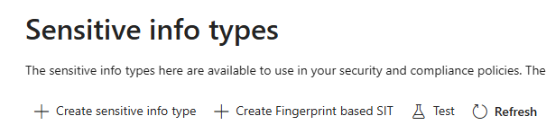
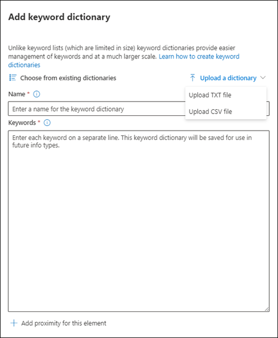
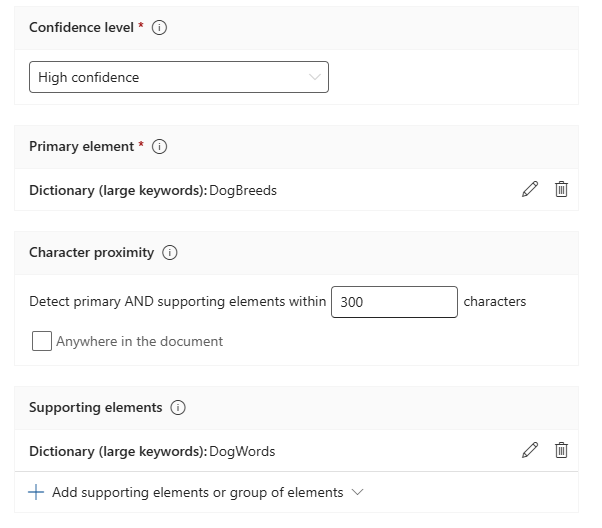
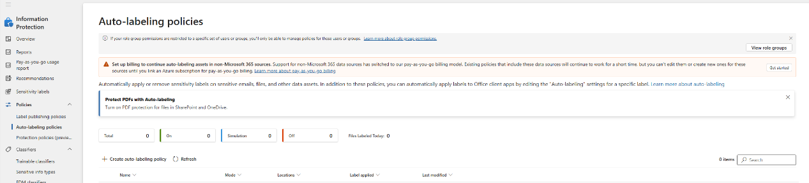
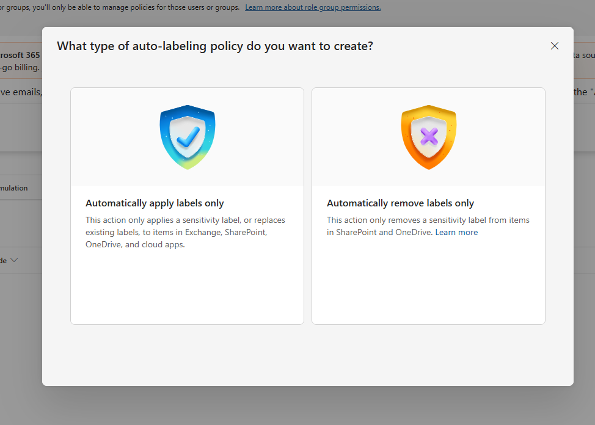

## Information protection — Project DogOps

In this section, you protect ProjectDogOps content by:

1. Defining a custom SIT based on keyword dictionaries.
2. Creating a DogOps sensitivity label with **client-side** auto-labeling.
3. Configuring a **service-side** auto-labeling policy that detects and protects matching content across Microsoft 365 locations.

Together these steps demonstrate how custom classifiers, sensitivity labels, and automated policies identify, label, and safeguard confidential project information. Access to Project DogOps material is limited to the **U.S. Sales** group, which already exists in your CDX tenant.

### Create a custom SIT — ProjectDogOps

1. The keyword dictionaries are included in this repo:
   - [`data/DogBreeds.txt`](../data/DogBreeds.txt)
   - [`data/DogWords.txt`](../data/DogWords.txt)

   Save them locally so you can upload them in the wizard.

2. In Microsoft Purview, go to **Information protection** > **Classifiers** > **Sensitive info types**.
3. Select **+ Create sensitive info type** in the top-left of the SIT page.

   

4. On **Name and description**, set:
   - **Name:** `DogOps`
   - **Description:** `ProjectDogOps`

5. On **Define patterns**, select **+ Create pattern** and configure:
   - **Primary element** (keyword dictionary, Word match): `DogBreeds`
     - Choose **Upload a dictionary** and upload `DogBreeds.txt`
     - Name the dictionary `DogBreeds`
     - Leave **Word match** selected

   

   - **Supporting element** (keyword dictionary, Word match): `DogWords`
     - Choose **Upload a dictionary** and upload `DogWords.txt`
     - Name the dictionary `DogWords`
     - Leave **Word match** selected
   - **Character proximity:** `300` (set confidence level as required)

   

6. Select **Save** to save the pattern, then **Next**.
7. On **Review settings**, verify the details, then select **Create**.

> **Verify:** the `DogOps` SIT appears in the list with status **Published**.

### Create a sensitivity label — DogOps (client-side auto-labeling)

1. Go to **Information protection** > **Sensitivity Labels**, check **Highly Confidential**, then select **+ Create label in group** at the top-left of the labeling scheme.
2. On **Label details**, set:
   - **Name:** `DogOps`
   - **Display name:** `DogOps`
   - **Description for users:** This label is used for documents that contain ProjectDogOps confidential information.
   - **Description for admins:** This sensitivity label is intended for content that contains confidential ProjectDogOps information and requires restricted access and enhanced protection controls.

3. On **Scope**, select **Files & other data assets**, **Emails**, and **Groups & sites**, then select **Next**.
4. On **Choose protection settings**, select **Control access** and **Apply content marking**, then select **Next**.
5. On **Access control**, select **Configure access control settings**, then set:
   - Assign permissions now
   - User access to content expires: **Never**
   - Allow offline access: **Never**
   - Assign permissions to specific users and groups: **U.S. Sales** (default permission **Editor**)
   - Leave **Use dynamic watermarking** and **Use Double Key Encryption** unchecked

6. On **Content marking**, turn content marking **On**. Add a footer: `Classified as Confidential`. Select **Next**.
7. On **Auto-labeling**, turn auto-labeling **On**, then configure:
   - Add condition → Name `DogOps`, Group operator **Any of these**
   - Add **Sensitive info types**: `DogOps`

8. Set the action to **Automatically apply the label**. Set the user message to: _ProjectDogOps: Contains confidential project data._
9. On **Define protection settings for groups and sites**, choose **External sharing** and **Conditional Access**, then select **Next**.
10. Select **Control external sharing from labeled SharePoint sites** and choose **New and existing guests**. Leave **Microsoft Entra Conditional Access** unchecked.
11. Review your settings, then select **Save label**.

> **Verify:** the `DogOps` label appears under **Highly Confidential**.

### Publish the DogOps label

Reference: [Publish sensitivity labels by creating a label policy](https://learn.microsoft.com/en-us/purview/create-sensitivity-labels?tabs=modern-label-scheme#publish-sensitivity-labels-by-creating-a-label-policy)

1. Go to **Information protection** > **Policies** > **Label publishing policies**.
2. Select **Publish label**.

   > _The screenshot below shows the HR publishing flow as a reference; the buttons and layout are identical for DogOps._

   

3. **Label to publish:** Highly Confidential/DogOps
4. **Admin units:** select **Next**.
5. **Users and groups:** select **Edit**, choose **Include only specific**, and add the **U.S. Sales** group.

   > _The reference screenshot shows the HR group; for this policy pick **U.S. Sales** instead._

   

6. **Settings** — select both:
   - Users must provide a justification to remove a label or lower its classification
   - Require users to apply a label to their emails and documents

   

7. Select **Next**.
8. Leave the default settings for the next few steps (Documents, Emails, Sites & Groups, etc.).
9. Name the policy `DogOps publishing policy`.
10. **Review and finish** > **Submit**.

> **Verify:** **DogOps publishing policy** appears with status **On (success)**.

### Create an auto-labeling policy for DogOps (service-side)

Reference: [Creating an auto-labeling policy](https://learn.microsoft.com/en-us/purview/apply-sensitivity-label-automatically?tabs=apply-label#creating-an-auto-labeling-policy)

1. Go to **Information protection** > **Policies** > **Auto-labeling policies**, then select **Create auto-labeling policy**.

   

2. On **What type of auto-labeling policy do you want to create**, choose **Automatically apply labels only**.

   

3. On **Name and description**, enter:
   - **Name:** `Auto-labeling for Project DogOps`
   - **Description:** `Auto-labeling for Project DogOps`

4. On **Label**, select **Highly Confidential/DogOps**, then **Next**.
5. On **Locations**, select all of, then **Next**:
   - Exchange Online (EXO)
   - SharePoint Online (SPO)
   - OneDrive (OD)

6. Create a common rule with the condition: **content contains sensitive info type `DogOps`**.
7. **Additional label settings:** All locations.

   > _Replace existing labels if their priority is lower for all locations (Exchange, SharePoint, OneDrive), regardless of whether the existing label was applied automatically or manually._

8. On **Policy mode**, select **Run in simulation mode** and enable **Automatically turn on policy if not modified after 7 days**.
9. Review the configuration, then select **Finish**.

   > **Note:** the simulation typically completes within a few hours, after which you can turn it on manually.

> **Verify:** the policy appears in **Auto-labeling policies** with status **Simulation**.